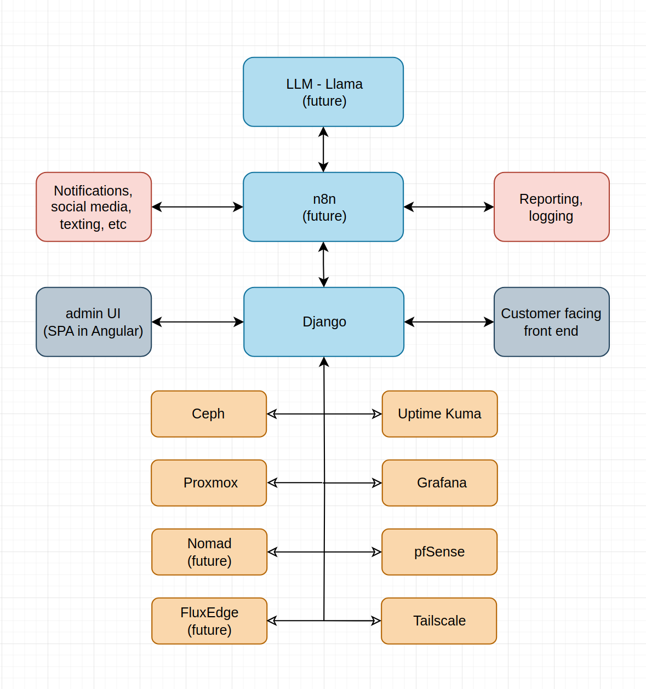

# Skyy-Command

Skyy-Command is a powerful infrastructure orchestration and automation platform intended for the management of one or several clustered microdatacenters. Built by [HelloSkyy](https://helloskyy.io), it is a full-stack control plane for managing decentralized compute, GPU-accelerated node deployments, network orchestration, and internal DevOps infrastructure across baremetal, as well as decentralized cloud providers like FluxEdge.

Skyy-Command simplifies the lifecycle of infrastructure, private and customer workloads — combining declarative config, powerful automation, secure secret handling, and dynamic observability, all driven by code and optionally enriched by AI.

---

## Purpose

Skyy-Command empowers individuals and small teams to:

- **Deploy and orchestrate compute infrastructure** with best-practice automation  
- **Control baremetal and decentralized nodes** using Proxmox, FluxEdge, Ceph, and Nomad  
- **Automate AI model and GPU intensive deployments** using Kubernetes manifests  
- **Enforce desired infrastructure state** with Ansible, ArgoCD, and custom decision engines  
- **Maintain private documentation** with Git-synced Obsidian vaults  
- **Operate secure micro datacenters** with dynamic firewall control and DNS management  

---

<p align="center">
  
</p>

### Skyy-Command Architecture:

<p align="center">
  
</p>

---

## 🚀 Local Deployment!

This section outlines the basics for setting up Skyy-Command on a developer machine.

---

### 1. Clone the repository

```bash
git clone git@github.com:helloskyy-io/Skyy-Command.git
cd Skyy-Command
```

---

### 2. Open Documentation with Obsidian

Skyy-Command uses a Git-tracked Obsidian vault for internal documentation. This is where you will find the documentation on how to use it:

1. [Download and install Obsidian](https://obsidian.md)
2. Open Obsidian and right-click the app icon or menu
3. Select **"Open another vault"** → **"Open folder as vault"**
4. Choose the `docs/` folder inside this repo
5. You can now browse, edit, and extend internal notes — all synced with Git

---

### 3. Create and Activate Conda Environment

The backend and automation layers of Skyy-Command require a Conda environment. To set it up:

```bash
# Ensure conda is installed (via Anaconda, Miniconda, or Mamba)
# Create the environment from the included environment file:
conda env create -f environment.yaml

# Activate the new environment
conda activate skyy-command
```


---

*(More deployment details coming soon…)*

---

You’re now ready to run Skyy-Command scripts, backend services, and orchestration tools locally.

---

## 📄 License

MIT License — see [LICENSE](./LICENSE)

---

## 💬 Questions or Feedback?

Contact the HelloSkyy team at [https://helloskyy.io](https://helloskyy.io) or open an issue in this repository.


